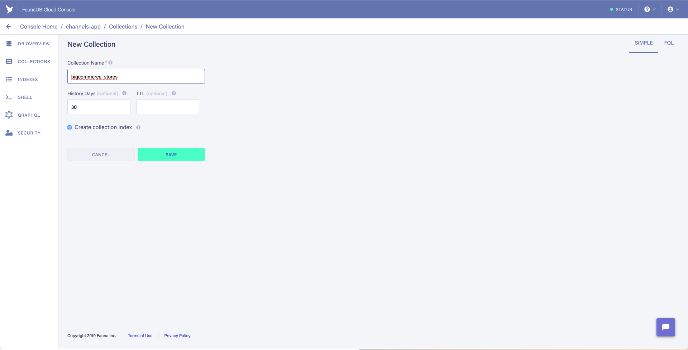
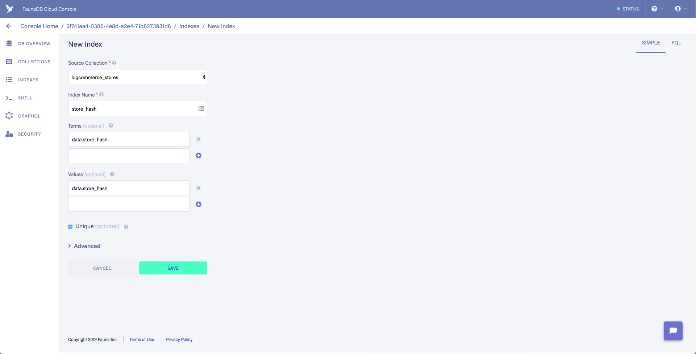

# Big Commerce Subscription
 

## Overview
bc-subscription is a bigcommerce app for creating 💪 flexible 📖publication subscription service.

### Why built this app?
All the existing subscription apps only creates subscription service for recurring payment for the same product. This does not work for publication subscription where each publication is a different product with a varied price. This app aims to provide a solution the following use cases:

### Use case
- Customer should be able to subscribe to a periodic publication.
	- Publication period is not defined. The customer will receive a new publication whenever it is published.
	- The publication title is different at every publication. Customer is billed on the latest publication title.
	- The publication price is not set. The customer subscribe to a product series with no fix price.
- Customer should be able to adjust the quantity of product they are subscribing. This means the customer can change the number of - copies of the publications they are ordering.
- Account customers can subscribe without paying upfront. They will be invoiced to be paid later.
- General customers must store their credit card so they are charged at when a new publication is issued.
- Shop staff controls what product is added to the new publication or issue.
- New publication or issue is created on demand by the shop staff. Basically, whenever the new publication is ready for print.
## Features
This app serves two kinds of users. Customer that subscribe and manages their subscription. Shop staff that manages and process all the subscriptions

### Shop staff
- Create/edit subscription.
	- Change subscription name
	- Change subscription image
	- Minimum subscribing period
	- Customer group restriction.
- Add/delete books to a subscription
	- Books can have variants. Like English, Chinese and Korean.
- Edit subscribers
	- Add/remove customer's subscription.
	- Edit customer's subscription quantity
	- Edit customer's subscription shipping (yes/no)
- Issue processing
	- Create an issue by adding subscriptions. An issue can have multiple subscriptions.
	- Issue processing will generate orders for all the subscribers
		- If the subscriber have credit card stored, charge the card. Otherwise set the order as pay via invoice
		- Credit card payment should have credit card surcharge. Credit card surcharge should be a bigcommerce product so the amount can be changed.
		- The order should have all the products in each subscription.
		- Customer's locality, issue name and subscription name(s) should be saved in a custom order field.
### Customer
- Add/edit/remove subscription
	- The customer can make changes to each subscription's shipping and quantity
	- A subscription can only be remove when the minimum subscription period are meet.
	- All changes are saved when the customer click on the save button.
- Account customers can subscribe without stored credit card
- Non-account customer must have stored credit card to subscribe.
	- The customer must agree/authorize to charge the credit card
## Confirmation email
- Send confirmation email after subscription changes. Changes can be made by the shop staff or the customer. The confirmation email should describe what changes are made. A new subscription should say a welcome message. Cancellation should say a sorry to see you go message. The email is send to both the customer and bcc a shop email.

## App Installation

## Local Development & Testing

To get the app running locally, you'll need the following dependencies:

 - A BigCommerce Store: you can sign up for a trial [here](https://www.bigcommerce.com/essentials/) or use an existing store / sandbox store
 - Create API credentials: you can find instructions [here](https://developer.bigcommerce.com/api-docs/getting-started/authentication#authentication_getting-api-credentials)
 - A Netlify account: Sign Up for netlify [here](https://app.netlify.com/signup)
 - ngrok: You can install using homebrew `brew cask install ngrok`

### Setup Project

Run the following commands:

 1. `npm install netlify-cli -g`

 2. `netlify init`

	Notes:  

	 - You can use most of the specified defaults when prompted
	 - Build command should be `yarn build`
	 - Directory should be `packages/app-react/build`

 3. `netlify addons:create fauna`

 4. `netlify addons:auth fauna`

	 Notes:

	  - You need to agree to import the database
	  
### Setup FaunaDB DB and Index

 1. Log into FaunaDB and go to the db that was created from netlify
 2. Create a collection named `bigcommerce_stores` using defaults. To create a collection, click on the name of the database

 3. Create Index `store_hash` in `bigcommerce_stores`

	 Notes:

	  - Make sure to add data.store_hash to both terms and values
	  - Select the unique checkbox

### Setup ngrok tunnel for app

 1. `cp ngrok-sample.yml ngrok.yml` 
 2. Retrieve and replace the auth token in the `ngrok.yml` file
 3. Set `authtoken` in `ngrok.yml` file with value from https://dashboard.ngrok.com/get-started
 4. Set hostname to `<username>.ngrok.io` in the `ngrok.yml` file.

	 Notes: 

	  - The username can be whatever you like

### Setup BC App

 1. Log into your store's [dev tools](https://devtools.bigcommerce.com/my/apps)
 2. Create an app and in the "Technical" section, set the following URLs:

	  - Auth Callback URL: `https://<username>.ngrok.io/.netlify/functions/bigcommerce_auth`
	  - Load Callback URL: `https://<username>.ngrok.io/.netlify/functions/bigcommerce_load`
	  - Uninstall Callback URL: `https://<username>.ngrok.io/.netlify/functions/bigcommerce_uninstall`

 3. Select "modify" permissions for the following scopes:

	  - Channel Settings
	  - Sites & Routes

### Setup .env

 1. `cp .env-sample .env`

 2. Update and replace the following in `.env`:

	- BC_CLIENT_ID: BigCommerce App Client Id
	- BC_CLIENT_SECRET: BigCommerce App Secret

	- BC_AUTH_CALLBACK: Replace with Auth Callback URL from above
	- APP_URL= Replace with ngrok hostname from above `https://<username>.ngrok.io/`

Note: The environment variables in `.env` will also need to be set in Netlify in order for the deployed version to work. [TODO]

### Start Service

In a terminal, execute the following in the root of the project directory to start ngrok: 

`ngrok start --config ngrok.yml site`

*Note*: if you stop and restart this process, it will give you a new host domain that you will need to update for each of the 3 Callback URLs in your app's dev tools section

In another terminal execute in the root of the project directory to start the service: 

`yarn netlify:dev`

The service will live reload on saved changes.  If you want to restart simply stop the `yarn netlify:dev` process and restart it, 
there should be no need to restart ngrok.

Reference: 
- https://docs.fauna.com/fauna/current/start/netlify

